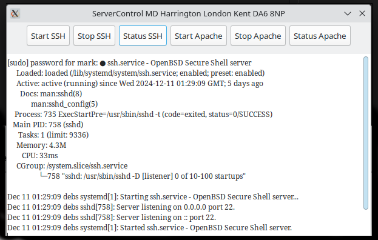

# Aim and objectives 

## The application is designed to  assist the  user to start and stop server services apache2 and SSh 




## Functions 
- Prompts the user for their sudo password.
- Allows the user to start, stop, and check the status of the services via buttons.
- Displays the output of commands in a styled GtkTextView.

## Explanation of code 

### Steps in operation of code 

- Initialize GTK: gtk_init.
- Load UI: Load the GUI description from servernewgui.glade.
- Password Prompt: Prompt the user for a password.
- Connect Signals: Attach button clicks to appropriate signal handlers.
- Run GTK Main Loop: gtk_main.
  
## Included Libraries
```
#include <gtk/gtk.h>
#include <stdlib.h>
#include <string.h>
#include <unistd.h>
#include <stdio.h>
#include <glib.h>

```

### Explanation of the funtionaity of each 

- gtk/gtk.h: Includes the GTK+ library for building graphical user interfaces.
- stdlib.h, string.h, unistd.h: Standard C libraries for memory management, string handling, and system-level operations.
- stdio.h: Provides standard input/output functions like printf.
- glib.h: Part of the GTK framework, provides utilities like g_strdup.
  
### Structure to hold widgets 

``` 
typedef struct {
    GtkWidget *window;
    GtkButton *btnstartssh, *btnstopssh, *btnstatussh;
    GtkButton *btnstartapach, *btnstopapach, *btnstatusapache;
    GtkTextView *txtview1;
} AppWidgets;
```

### Explanation

This structure, AppWidgets, holds references to all the GTK widgets used in the application. It provides an easy way to pass these widgets around.

### Password Prompt Function 

```
void prompt_password(GtkWindow *parent_window) {
    GtkWidget *dialog, *content_area, *entry;
    GtkDialogFlags flags = GTK_DIALOG_MODAL | GTK_DIALOG_DESTROY_WITH_PARENT;
    gint response;

    // Create a dialog with an entry widget for password input
    dialog = gtk_dialog_new_with_buttons("Enter Password",
                                         parent_window,
                                         flags,
                                         "_OK",
                                         GTK_RESPONSE_OK,
                                         "_Cancel",
                                         GTK_RESPONSE_CANCEL,
                                         NULL);
    gtk_window_set_default_size(GTK_WINDOW(dialog), 250, -1);

    content_area = gtk_dialog_get_content_area(GTK_DIALOG(dialog));
    entry = gtk_entry_new();
    gtk_entry_set_visibility(GTK_ENTRY(entry), FALSE); // Hide text for password input
    gtk_entry_set_placeholder_text(GTK_ENTRY(entry), "Enter your sudo password");

    gtk_container_add(GTK_CONTAINER(content_area), entry);
    gtk_widget_show_all(dialog);

    response = gtk_dialog_run(GTK_DIALOG(dialog));

    if (response == GTK_RESPONSE_OK) {
        const char *password = gtk_entry_get_text(GTK_ENTRY(entry));
        if (password && strlen(password) > 0) {
            sudo_password = g_strdup(password); // Save the password securely
        } else {
            fprintf(stderr, "Password cannot be empty. Exiting.\n");
            gtk_widget_destroy(dialog);
            exit(EXIT_FAILURE);
        }
    } else {
        fprintf(stderr, "Password input canceled. Exiting.\n");
        gtk_widget_destroy(dialog);
        exit(EXIT_FAILURE);
    }

    gtk_widget_destroy(dialog);
}
```

### Explanation 

## Purpose: 

- Prompts the user for their sudo password through a modal dialog.
Behavior:

    The password is hidden while typing (gtk_entry_set_visibility).
    Stores the password in the global variable sudo_password.

### Command Execution Function 

```
gboolean execute_command(const char *command, GtkTextView *text_view) {
    char full_command[512];
    FILE *pipe;

    snprintf(full_command, sizeof(full_command), "echo '%s' | sudo -S %s 2>&1", sudo_password, command);
    pipe = popen(full_command, "r");

    if (!pipe) {
        perror("popen");
        return FALSE;
    }

    GtkTextBuffer *buffer = gtk_text_view_get_buffer(text_view);
    gtk_text_buffer_set_text(buffer, "", -1); // Clear any existing text

    char buffer_line[256];
    while (fgets(buffer_line, sizeof(buffer_line), pipe)) {
        GtkTextIter end;
        gtk_text_buffer_get_end_iter(buffer, &end);
        gtk_text_buffer_insert(buffer, &end, buffer_line, -1);
    }

    int ret_code = pclose(pipe);
    if (WEXITSTATUS(ret_code) != 0) {
        GtkTextIter end;
        gtk_text_buffer_get_end_iter(buffer, &end);
        gtk_text_buffer_insert(buffer, &end, "\nCommand failed.\n", -1);
        return FALSE;
    }

    GtkTextIter end;
    gtk_text_buffer_get_end_iter(buffer, &end);
    gtk_text_buffer_insert(buffer, &end, "\nCommand executed successfully.\n", -1);

    return TRUE;
}
```

## Purpose 

-  Executes a system command (e.g., starting/stopping a service) with sudo.

### Key Points 

- Uses popen to execute the command and read its output.
- Outputs the result to a GtkTextView widget.
- Returns TRUE if the command succeeds, FALSE otherwise.

##   Button Signal Handlers

``` 
void on_btnstartssh_clicked(GtkButton *button, gpointer user_data) {
    AppWidgets *widgets = (AppWidgets *)user_data;
    execute_command("systemctl start ssh", widgets->txtview1);
}
```

### Purpose

 When a button is clicked, executes a relevant command (e.g., start/stop/status for ssh or apache2).

###  How it Works 

- Retrieves the AppWidgets structure passed as user_data.
- Calls execute_command with the appropriate command.

## The Main Function 

```
int main(int argc, char *argv[]) {
    gtk_init(&argc, &argv);

    GtkBuilder *builder = gtk_builder_new_from_file("servernewgui.glade");
    AppWidgets widgets;

    widgets.window = GTK_WIDGET(gtk_builder_get_object(builder, "mainwindow"));
    prompt_password(GTK_WINDOW(widgets.window));

    widgets.txtview1 = GTK_TEXT_VIEW(gtk_builder_get_object(builder, "txtview1"));

    // CSS Styling for GtkTextView
    GtkCssProvider *cssProviderLog = gtk_css_provider_new();
    GtkStyleContext *context;

    gtk_css_provider_load_from_data(cssProviderLog,
                                    "textview {"
                                    "font-family: serif;"
                                    "font-size: 12px;"
                                    "color: green;"
                                    "}", -1, NULL);

    context = gtk_widget_get_style_context(GTK_WIDGET(widgets.txtview1));
    gtk_style_context_add_provider(context,
                                   GTK_STYLE_PROVIDER(cssProviderLog),
                                   GTK_STYLE_PROVIDER_PRIORITY_USER);

    g_object_unref(cssProviderLog);

    // Assign buttons and signals
    widgets.btnstartssh = GTK_BUTTON(gtk_builder_get_object(builder, "btnstartssh"));
    g_signal_connect(widgets.btnstartssh, "clicked", G_CALLBACK(on_btnstartssh_clicked), &widgets);

    // Similar setup for other buttons...

    g_signal_connect(widgets.window, "destroy", G_CALLBACK(gtk_main_quit), NULL);

    g_object_unref(builder);

    gtk_widget_show(widgets.window);
    gtk_main();

    g_free(sudo_password);

    return 0;
}
```

### Purpose 

-  Initializes the GTK application.


# Why do we have a main function 

The main() function in a C program is the entry point of the application. When the operating system runs a program, it begins execution by calling the main() function. This is why every C program must have a main() function—it tells the system where to start.

## Reasons we have main() 

- Standardized Starting Point
- C and most C-based languages are designed to start program execution from the main() function. This standardization allows compilers and operating systems to know where to begin executing the code.

## Program Initialization

- The main() function is where the program sets up all necessary resources and prepares the environment for the program to run. In this case, it initializes GTK, sets up the user interface, and starts the event loop.

## Integration with System

- The main() function typically takes two arguments: argc and argv. These are used to pass command-line arguments to the program, allowing for dynamic behavior based on user input at runtime.


``` 
int main(int argc, char *argv[])
```

 - argc: The number of command-line arguments  
 When you start a  program these act like switches so that you can exert  extra control over the application 

 - argv: An array of strings representing the arguments.


 ## Notes for other people learning or using this to study 

 ###  ***  Notice the CSS ***  used in code 

 ```
 // CSS Styling for GtkTextView
    GtkCssProvider *cssProviderLog = gtk_css_provider_new();
    GtkStyleContext *context;

    gtk_css_provider_load_from_data(cssProviderLog,
                                    "textview {"
                                    "font-family: serif;"
                                    "font-size: 12px;"
                                    "color: green;"
                                    "}", -1, NULL);

    context = gtk_widget_get_style_context(GTK_WIDGET(widgets.txtview1));
    gtk_style_context_add_provider(context,
                                   GTK_STYLE_PROVIDER(cssProviderLog),
                                   GTK_STYLE_PROVIDER_PRIORITY_USER);

    g_object_unref(cssProviderLog);

``` 

 #### C , C++ and many other programming high level langauges are not just about  C , C ++ but also require that you have knowledge of HTML , Bash , CSS , Javascript 

 Its not just a case of learning C  or one singular langauge  it is very much an entire over view of many technologies now 

 
 ## Enjoy and hope this provides  both  incite and intro into C , C++ 

 ### Thankyou  MD Harrington  London Kent DA6 8NP

 ####  Addtional  links  ref programming and other tasks I do  also  a little bit about myself 

- https://www.facebook.com/mark.harrington.14289
  
- https://pastebin.com/u/Mark2020H 

- https://codeshare.io/codes

- https://www.instagram.com/markukh2021

###  Happy new year and  hope you all have a good XMAS , Hopefully one of peace 


